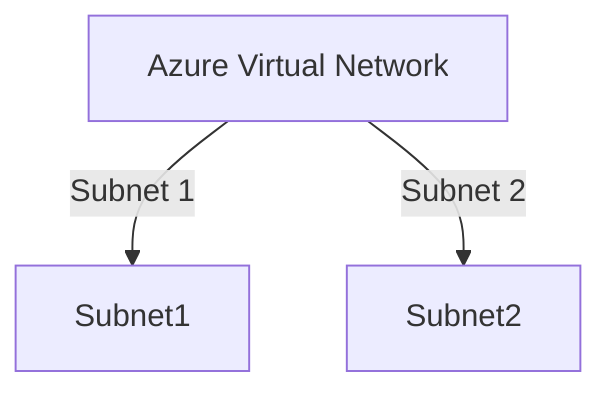

# Azure VNET Terraform Module

This module provisions an Azure Virtual Network (VNET) with configurable subnets.

## Usage Example

```hcl
module "vnet" {
  source              = "../../modules/vnet"
  vnet_name           = "vnet-dev-westeurope"
  location            = "westeurope"
  resource_group_name = "rg-dev-westeurope"
  address_space       = ["10.0.0.0/16"]
  
  subnets = {"subnet1":{"address_prefixes":["10.0.1.0/24"]},"subnet2":{"address_prefixes":["10.0.2.0/24"]}}
  
  tags = {"ManagedBy":"Pawel","Project":"OpellaInterview","environment":"dev"}
}
```

# Azure VNET Terraform Module - Inputs and Outputs

## Inputs

| Name                   | Description                                        | Type                         | Default | Required |
|------------------------|----------------------------------------------------|------------------------------|---------|----------|
| `vnet_name`             | The name of the virtual network                    | `string`                     | n/a     | yes      |
| `location`             | The Azure region where the VNET will be deployed    | `string`                     | n/a     | yes      |
| `resource_group_name`  | The name of the resource group                     | `string`                     | n/a     | yes      |
| `address_space`        | A list of address spaces for the VNET               | `list(string)`               | n/a     | yes      |
| `subnets`              | A map of subnets with address prefixes              | `map(object({ address_prefixes = list(string) }))` | n/a     | yes      |
| `tags`                 | Tags to associate with the VNET                     | `map(string)`                | `{}`    | no       |
| `nsg_rules`            | A list of NSG rules to apply to each subnet        | `list(object({...}))`        | Default to deny rule | no       |

## Outputs

| Name         | Description                                             | Value                                                   |
|--------------|---------------------------------------------------------|---------------------------------------------------------|
| `vnet_id`    | The ID of the created Virtual Network                    | `azurerm_virtual_network.this.id`                        |
| `subnet_ids` | A map of subnet names and their corresponding subnet IDs  | `{ for k, v in azurerm_subnet.this : k => v.id }`         |


## Network Diagram

